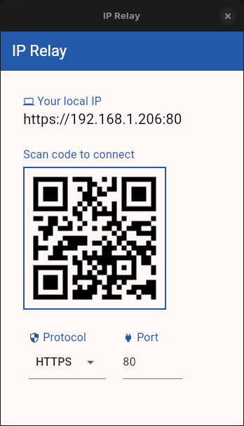

# IP Relay

IP Relay is a tool built using flutter to broadcast your device's IP address for easier mobile testing and peer programming.

<table>
  <tr>
    <td>
      
    </td>
    <td>
      Download the tool using below links:  
      <br><br>
      <a href="https://github.com/ankur1812/ip-relay/raw/refs/heads/main/app-bundles/linux/ip_relay_v0.0.1.tar.xz" download>
        Linux
      </a>
      <br> 
      <a href="https://github.com/ankur1812/ip-relay/raw/refs/heads/main/app-bundles/win/ip_relay_v0.0.1.zip" download>
        Windows
      </a>
      <br>
      <a href="#"> MacOS </a>
    </td>
  </tr>
</table>

<br><br>

## Developer Notes

### 1. Clone Project
`git clone git@github.com:ankur1812/ip-relay.git`

### 2. Install Dependencies
`flutter pub get`

### 3. Running the project
```
flutter run -d windows  # For Windows
flutter run -d macos    # For macOS
flutter run -d linux    # For Linux
```

### 3. Building the project

The app meta can be configured the `CMakeLists.txt` files for linux / macOS / windows.

```
flutter build linux    # For Linux
flutter build windows    # For Windows
```

<br><br>

### Some Flutter Documentation [Getting Started]

This project is a starting point for a Flutter application.

A few resources to get you started if this is your first Flutter project:

- [Lab: Write your first Flutter app](https://docs.flutter.dev/get-started/codelab)
- [Cookbook: Useful Flutter samples](https://docs.flutter.dev/cookbook)

For help getting started with Flutter development, view the
[online documentation](https://docs.flutter.dev/), which offers tutorials,
samples, guidance on mobile development, and a full API reference.

This project was initialized using the `flutter create` command.
`flutter create --platforms=windows,macos,linux ip_broadcaster`


